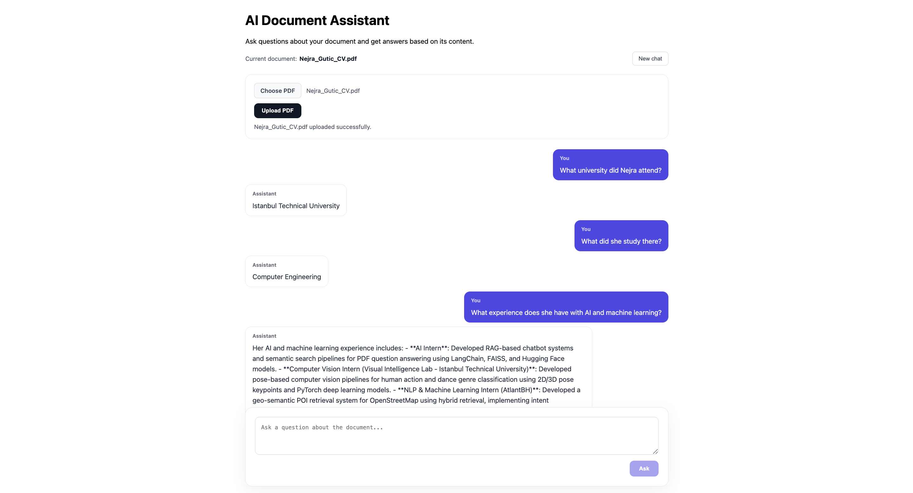
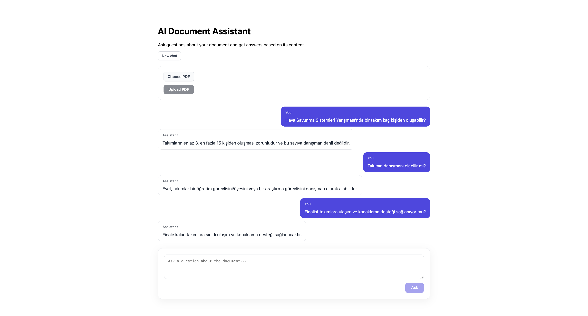

# 🤖 AI Document Assistant

AI Document Assistant is a full-stack Retrieval-Augmented Generation (RAG) application that allows users to ask questions about PDF documents and receive context-aware answers based on their content.

The project combines **FastAPI**, **React**, **LangChain**, **FAISS**, **Sentence Transformers**, and **Google Gemini** to build an end-to-end document question-answering system.

The application supports both a structured built-in Q&A knowledge base and dynamically uploaded PDF documents.

---

## ✨ Features

- 📄 Upload and process PDF documents
- 🔍 Semantic search over document content
- 🧠 Retrieval-Augmented Generation (RAG)
- 🔗 LangChain-based document and retrieval pipeline
- ⚡ FAISS vector similarity search
- 🧩 Custom Q&A parsing for structured documents
- 📚 Generic chunking for user-uploaded PDFs
- 💬 Context-aware multi-turn conversations
- 🔄 Start a new chat and clear conversation history
- 🎯 Combined ranking across built-in and uploaded documents
- 🌐 FastAPI REST backend
- ⚛️ React frontend
- 🚦 API rate-limit error handling

---

## 📸 Screenshots

### Chat with an Uploaded Document

The application can process an uploaded PDF and answer questions based on its content.



### Structured Q&A Knowledge Base

The built-in knowledge base uses custom Q&A parsing to preserve structured information such as sections, questions, and answers.



---

## 🏗️ Architecture

The application uses a Retrieval-Augmented Generation pipeline:

```text
                    ┌─────────────────────┐
                    │     User Query      │
                    └──────────┬──────────┘
                               │
                               ▼
                    ┌─────────────────────┐
                    │      Embedder       │
                    │ SentenceTransformer │
                    └──────────┬──────────┘
                               │
                               ▼
              ┌────────────────────────────────┐
              │      LangChain Retrieval       │
              └───────────────┬────────────────┘
                              │
                  ┌───────────┴───────────┐
                  ▼                       ▼
        ┌──────────────────┐    ┌──────────────────┐
        │ Fixed Q&A FAISS  │    │ Uploaded PDF     │
        │ Vector Store     │    │ FAISS Vector     │
        │                  │    │ Store            │
        └────────┬─────────┘    └────────┬─────────┘
                 │                       │
                 └───────────┬───────────┘
                             ▼
                    Combined Ranking
                             │
                             ▼
                   Top Relevant Context
                             │
                             ▼
                      Prompt Builder
                             │
                             ▼
                       Google Gemini
                             │
                             ▼
                          Answer
```

Only the most relevant parts of the documents are sent to the language model instead of sending the entire document with every request.

---

## 🔍 RAG Pipeline

### 1. Document Processing

The application supports two document-processing strategies.

#### Structured Q&A Knowledge Base

The built-in Q&A dataset uses a custom parser that preserves:

- section
- question
- answer
- combined text

These fields are stored as metadata inside LangChain `Document` objects.

```text
Structured Q&A data
        ↓
Custom Q&A parser
        ↓
LangChain Documents
        ↓
Embeddings
        ↓
FAISS
```

This preserves the structure of the original Q&A document instead of treating it as arbitrary text.

#### User-Uploaded PDFs

Uploaded PDFs use a generic pipeline:

```text
PDF
 ↓
PyMuPDF text extraction
 ↓
Generic chunking
 ↓
LangChain Documents
 ↓
Embeddings
 ↓
FAISS
```

This allows the application to work with arbitrary text-based PDF documents.

---

### 2. Embeddings

Document chunks and user queries are converted into dense vector representations using a Sentence Transformer embedding model.

A custom embedding adapter implements the LangChain `Embeddings` interface, allowing the existing embedding implementation to work directly with LangChain.

---

### 3. Vector Search

LangChain's FAISS integration stores document embeddings and performs semantic similarity search.

The system can search both:

- the built-in structured Q&A knowledge base
- the currently uploaded PDF

Results from both vector stores are compared using their similarity scores and the most relevant results are selected.

---

### 4. Context Construction

The top retrieved documents are converted into context for the language model.

For structured Q&A documents, additional metadata such as the section, original question, and answer is preserved.

For generic uploaded documents, the retrieved text chunks are used directly.

---

### 5. Answer Generation

The retrieved context, user question, and conversation history are passed to Google Gemini.

The model is instructed to answer using the retrieved document context and respond in the same language as the user's question.

---

### 6. Conversation History

The application stores previous question-answer pairs during the current conversation.

This allows follow-up questions such as:

```text
User: What university did Nejra attend?

Assistant: Istanbul Technical University.

User: What did she study there?
```

The second question can be interpreted using the previous conversation context.

Starting a new chat or uploading a new document clears the conversation history.

---

## 🛠️ Tech Stack

### Backend

- Python
- FastAPI
- LangChain
- FAISS
- Sentence Transformers
- Google Gemini API
- PyMuPDF
- Pydantic

### Frontend

- React
- JavaScript
- HTML
- CSS
- Vite

### Database

- PostgreSQL integration is planned for persistent document, user, and chat storage.

---

## 📁 Project Structure

```text
ai-document-assistant/
│
├── backend/
│   ├── main.py
│   ├── database.py
│   └── models.py
│
├── frontend/
│   └── ...
│
├── src/
│   └── rag/
│       ├── embedder.py
│       ├── generator.py
│       ├── generic_chunker.py
│       └── langchain_service.py
│
├── data/
│   └── metadata.json
│
├── docs/
│   ├── uploaded-document-chat.png
│   └── qa-knowledge-base-chat.png
│
├── requirements.txt
└── README.md
```

---

## 🚀 Running the Project

### 1. Clone the repository

```bash
git clone <repository-url>
cd ai-document-assistant
```

### 2. Create a virtual environment

```bash
python -m venv .venv
source .venv/bin/activate
```

### 3. Install backend dependencies

```bash
pip install -r requirements.txt
```

### 4. Configure environment variables

Create a `.env` file and add the required Gemini API configuration.

Do not commit API keys to GitHub.

### 5. Start the backend

```bash
uvicorn backend.main:app --reload
```

The API will run locally on port `8000`.

### 6. Start the frontend

```bash
cd frontend
npm install
npm run dev
```

The React application will run through the Vite development server.

---

## 🔌 API Endpoints

| Method | Endpoint | Description |
|---|---|---|
| `GET` | `/` | API health/home endpoint |
| `GET` | `/documents` | Get documents |
| `GET` | `/documents/{id}` | Get a document |
| `POST` | `/documents` | Create a document |
| `PUT` | `/documents/{id}` | Replace document data |
| `PATCH` | `/documents/{id}` | Update document data |
| `DELETE` | `/documents/{id}` | Delete a document |
| `POST` | `/api/documents/upload` | Upload and process a PDF |
| `POST` | `/api/chat` | Ask a question |
| `POST` | `/api/chat/reset` | Clear conversation history |

---

## 🧠 Why RAG?

Sending an entire document to a language model for every question can be inefficient and may exceed the model's context limits for large documents.

RAG solves this by retrieving only the document sections that are most relevant to the user's question.

Instead of:

```text
Question + Entire PDF → LLM
```

the application uses:

```text
Question
   ↓
Semantic Search
   ↓
Top Relevant Chunks
   ↓
Question + Relevant Context
   ↓
LLM
```

This reduces unnecessary context and helps the model focus on relevant information.

---

## 🔗 Why LangChain?

The first version of the project used custom vector-store and retrieval components.

LangChain was later integrated to provide a more standardized and modular RAG architecture.

LangChain is currently used for:

- `Document` representation
- FAISS integration
- semantic retrieval

Project-specific logic such as custom Q&A parsing, generic PDF chunking, prompt construction, embedding configuration, conversation history, and API integration remains implemented separately.

This keeps the application flexible while using standard LangChain components where they provide the most value.

---

## 🔮 Future Improvements

Planned improvements include:

- PostgreSQL persistence
- User authentication
- Per-user document storage
- Persistent chat history
- Multiple document support
- Source citations in generated answers
- Improved retrieval filtering
- Document management
- Docker support
- Deployment

---

## 📌 Current Status

The project currently supports an end-to-end RAG workflow:

```text
PDF processing
      ↓
LangChain Documents
      ↓
Embeddings
      ↓
FAISS vector search
      ↓
Relevant context retrieval
      ↓
Conversation-aware prompt
      ↓
Gemini answer generation
      ↓
React chat interface
```

The next development phase will focus on persistent storage and multi-user functionality.